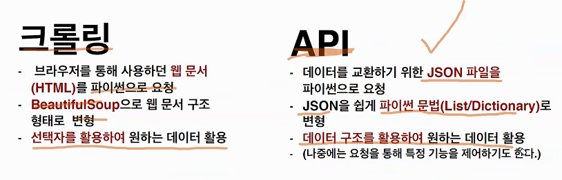
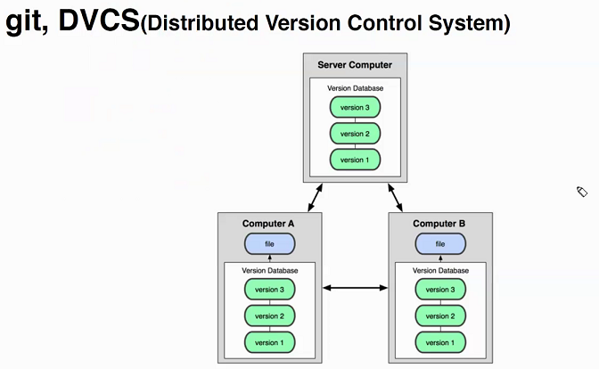
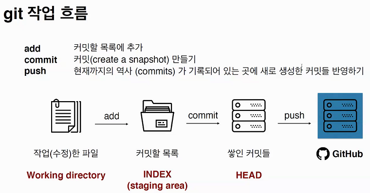
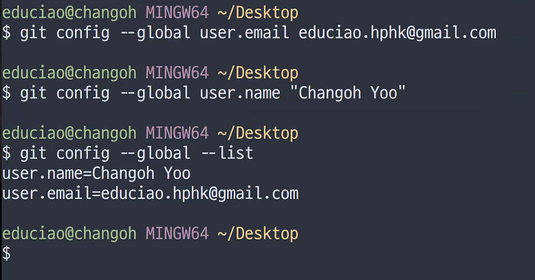
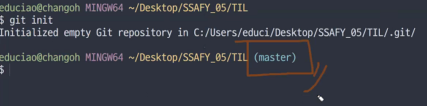
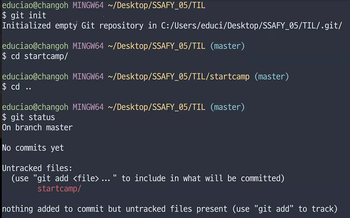
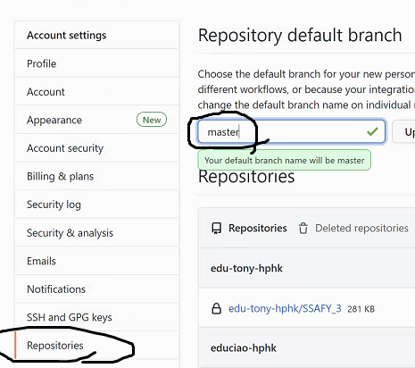
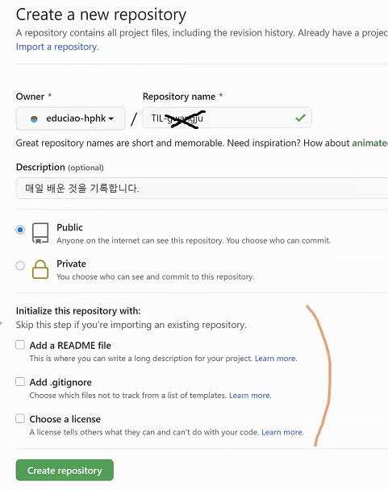
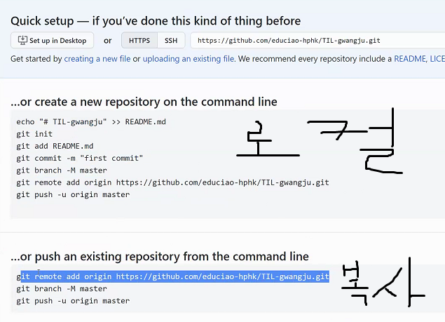

# 1월 15일 수업

## data

공공 데이터 활용시에는 설명서? 를 잘 읽어야 한다.

각각 자신의 인증키를 활용하여 사용해야한다.

이것을 요청변수에 맞춰 값을 채워넣는다.

 

## 2. Git !!!!!!!!!!

### 깃이란?

**(분산) 버전 관리 시스템** : 코드의 History를 관리하는 도구. 개발된 과정과 역사를 볼 수 있으며, 프로젝트 이전 버전을 복원하고 변경사항을 비교, 분석 및 병합도 가능

> 깃의 구조

* 깃이 있다면 파일들의 차이점을 알수 있고 수정과정을 남길 수 있다.

* 커밋 : 버전을 만드는 것이라고 생각
* 푸시 : 커밋들을 업로드

일반파일을 구글드라이브 드롭박스 등을 이용하는 것 처럼  git 이 관리한 코드로 깃랩, 깃헙 등을 이용

### 깃허브 등록 순서 (나의 메모)

`git add. `하면 해당경로의 모든 파일들을 목록에 추가해줌 (커밋을 만들기위한 파일 추가-커밋준비끝)

`git add 파일이름`하면  파일 추가됨

`git commit -m` "해당 커밋에 대한 메세지"   (메세지 반드시 존재해야함)

`git status` 깃의 상태와 새로운 파일과 수정여부에 대한 탐지?

`git log` 커밋 버전의 역사 - 작성자 정보

로컬에서 생성한 것 로컬 레포

깃헙에서 생성한것 리모트 레포

`git remote` 리모트 이름

`git remote -v`  연결 된 것들 주소 나옴 

`git push 명칭 master` 하면 온라인에 업로드 됨(최신으로 업로드)

깃랩 등록 관련해서 다시 적을 예정

참고  초기 등록시에는 로그인이 필요하다  

만일 로그인이 틀렸을 시에는 윈도우 자격증명관리자를통해 지우면 된다.

참고로 https://hpy.hk/gwangju2  스프레드 시트

